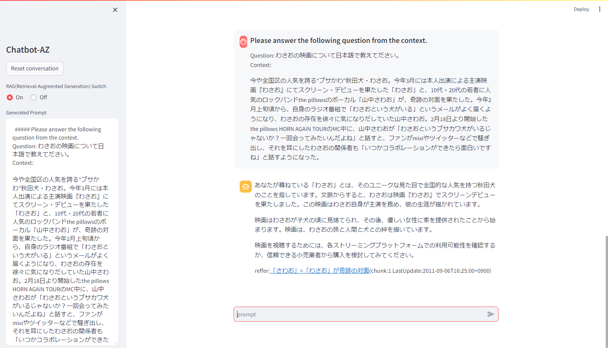
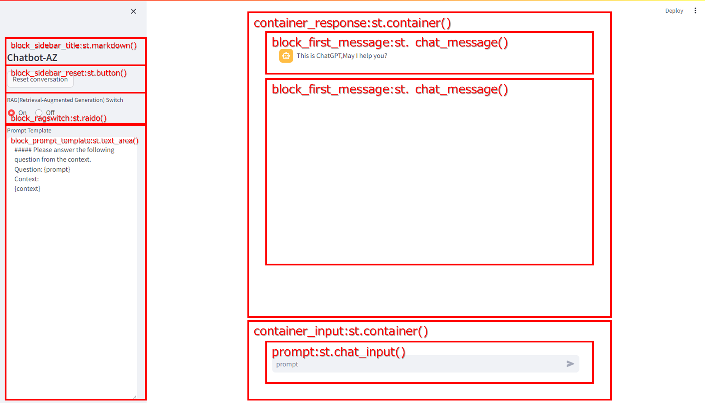

# chatbot-AZ - Azure OpenAIサービス用のシンプルなチャットボットプログラム



## 説明
これは、経験が浅いプログラマーがAzure OpenAI Service APIとRAG(Retrieval-Augmented Generation)の使い方を学ぶためのサンプルプログラムです。
OpenAI Chat Completion APIとのインタラクションや会話の継続性の処理方法、RAG(Retrieval-Augmented Generation)によるEmbedding処理を示しています。

ベクトルデータベースにはChromaを使用し、ChromaはHNSW（Hierarchical Navigable Small World）、
ANN（Approximate Nearest Neighbor search）アルゴリズムを用いてベクトル間の距離を測定します。
ディスタンスメトリックスにはコサイン類似度、距離計算アルゴリズムを使用します。
sentence transformerにはintfloat/multilingual-e5-large、LLM(Large Language Model)を使用し
512トークン長の1024次元のベクトルデータを生成しています。

## サンプルプログラム一覧
chatbot-AZ.pyでChromaベクトルデータベースを使用したRAG(Retrieval-Augmented Generation)を実装するにはChromaベクトルデータベースやダミーデータの登録が必要なため、Chromaデータベースの起動スクリプト、コレクションの登録、クエリー、削除のサンプルプログラムを同梱しています。
| ファイル名            | 説明                                         |
| -------------------- | ------------------------------------------- |
| run_vectordb.bat     | Chromaベクトルデータベースをサーバモードでローカルホスト:8080ポートで起動する|
| info_vectordb.py     | ベクトルデータベースのバージョンや保有コレクションの情報を表示するプログラム|
| register_vectordb.py | ベクトルデータベースにRAG用ダミーデータ(EVALRAGコレクション)を格納するプログラム|
| query_vectordb.py    | Chromaベクトルデータベースの単純なクエリープログラム|
| delete_vectordb.py   | ベクトルデータベースに格納されたRAG用ダミーデータ(EVALRAGコレクション)を削除するプログラム|
| chatbot-AZ.py        | ベクトルデータベースを用いたRAGが利用できるChatbotサンプルプログラム|
  

## チャットボットの仕様

- トークンには、ユーザとアシスタント間の最後の5回の会話が含まれています。これにより、会話の継続性が保証され、一貫した会話が続くかのような印象を与えます。
- システムプロンプトは以下のように固定されています:

```python
**経験豊富なエンジニアとして、複雑な技術問題を段階的に考慮し、質問に答え、アドバイスを提供します。**

```

- プロンプトのトークン制限サイズはAPIの指示に従って800トークンに設定されています。この制限を超えるとエラーが発生することが予想されます。
- API呼び出しは、非同期に行われ、応答メッセージがStreamlitのレスポンスコンテナにリアルタイムでストリーム化されることを前提としています。しかし、非同期通信中に表示できないバグが存在します。

## インストール
chatbot-AZの前提パッケージは正規化してrequirements.txtに記載してあります。
以下のpip installコマンドでインストールしてください。
**pip install -r requirements.txt**
実行環境はPython仮想環境(python -m venv venv)を構築することををお勧めします。

```shell
(venv) D:\Python\chatbot-AZ>pip install -r requirements.txt
Collecting openai==0.27.8 (from -r requirements.txt (line 1))
  Using cached openai-0.27.8-py3-none-any.whl.metadata (13 kB)
Collecting streamlit==1.27.1 (from -r requirements.txt (line 2))
  Using cached streamlit-1.27.1-py2.py3-none-any.whl.metadata (8.0 kB)
Collecting python-dotenv==1.0.0 (from -r requirements.txt (line 3))
  Using cached python_dotenv-1.0.0-py3-none-any.whl (19 kB)
Collecting chromadb==0.4.17 (from -r requirements.txt (line 4))
  Using cached chromadb-0.4.17-py3-none-any.whl.metadata (7.3 kB)

  ...

Installing collected packages: wcwidth, sentencepiece, pytz, pyreadline3, pypika, pure-eval, mpmath, monotonic, flatbuffers, filetype, zipp, wrapt, websockets, websocket-client, watchdog, validators, urllib3, tzdata, typing-extensions, traitlets, tornado, toolz, toml, threadpoolctl, tenacity, tabulate, sympy, soupsieve, sniffio, smmap, six, safetensors, rpds-py, regex, rapidfuzz, PyYAML, python-magic, python-iso639, python-dotenv, pygments, pyasn1, protobuf, prompt-toolkit, pillow, parso, packaging, overrides, opentelemetry-semantic-conventions, oauthlib, numpy, networkx, mypy-extensions, multidict, mdurl, MarkupSafe, lxml, jsonpointer, joblib, importlib-resources, idna, humanfriendly, httptools, h11, grpcio, greenlet, fsspec, frozenlist, filelock, executing, exceptiongroup, emoji, decorator, colorama, charset-normalizer, chardet, certifi, cachetools, blinker, bcrypt, backoff, attrs, async-timeout, annotated-types, yarl, tzlocal, typing-inspect, tqdm, SQLAlchemy, scipy, rsa, requests, referencing, python-dateutil, pydantic-core, pyasn1-modules, pyarrow, pulsar-client, opentelemetry-proto, matplotlib-inline, marshmallow, markdown-it-py, langdetect, jsonpatch, jinja2, jedi, importlib-metadata, googleapis-common-protos, gitdb, deprecated, coloredlogs, click, chroma-hnswlib, beautifulsoup4, asttokens, anyio, aiosignal, watchfiles, uvicorn, typer, torch, starlette, stack-data, scikit-learn, rich, requests-oauthlib, pydeck, pydantic, posthog, pandas, opentelemetry-exporter-otlp-proto-common, opentelemetry-api, onnxruntime, nltk, jsonschema-specifications, huggingface-hub, google-auth, gitpython, dataclasses-json, aiohttp, unstructured, torchvision, tokenizers, opentelemetry-sdk, openai, langsmith, kubernetes, jsonschema, ipython, fastapi, transformers, opentelemetry-exporter-otlp-proto-grpc, langchain, altair, streamlit, sentence-transformers, chromadb
Successfully installed MarkupSafe-2.1.5 PyYAML-6.0.1 SQLAlchemy-2.0.25 aiohttp-3.9.3 aiosignal-1.3.1 altair-5.2.0 annotated-types-0.6.0 anyio-3.7.1 asttokens-2.4.1 async-timeout-4.0.3 attrs-23.2.0 backoff-2.2.1 bcrypt-4.1.2 beautifulsoup4-4.12.3 blinker-1.7.0 cachetools-5.3.2 certifi-2024.2.2 chardet-5.2.0 charset-normalizer-3.3.2 chroma-hnswlib-0.7.3 chromadb-0.4.17 click-8.1.7 colorama-0.4.6 coloredlogs-15.0.1 dataclasses-json-0.6.4 decorator-5.1.1 deprecated-1.2.14 emoji-2.10.1 exceptiongroup-1.2.0 executing-2.0.1 fastapi-0.109.1 filelock-3.13.1 filetype-1.2.0 flatbuffers-23.5.26 frozenlist-1.4.1 fsspec-2023.12.2 gitdb-4.0.11 gitpython-3.1.41 google-auth-2.27.0 googleapis-common-protos-1.62.0 greenlet-3.0.3 grpcio-1.60.1 h11-0.14.0 httptools-0.6.1 huggingface-hub-0.20.3 humanfriendly-10.0 idna-3.6 importlib-metadata-6.11.0 importlib-resources-6.1.1 ipython-8.21.0 jedi-0.19.1 jinja2-3.1.3 joblib-1.3.2 jsonpatch-1.33 jsonpointer-2.4 jsonschema-4.21.1 jsonschema-specifications-2023.12.1 kubernetes-29.0.0 langchain-0.0.334 langdetect-1.0.9 langsmith-0.0.86 lxml-5.1.0 markdown-it-py-3.0.0 marshmallow-3.20.2 matplotlib-inline-0.1.6 mdurl-0.1.2 monotonic-1.6 mpmath-1.3.0 multidict-6.0.5 mypy-extensions-1.0.0 networkx-3.2.1 nltk-3.8.1 numpy-1.26.3 oauthlib-3.2.2 onnxruntime-1.17.0 openai-0.27.8 opentelemetry-api-1.22.0 opentelemetry-exporter-otlp-proto-common-1.22.0 opentelemetry-exporter-otlp-proto-grpc-1.22.0 opentelemetry-proto-1.22.0 opentelemetry-sdk-1.22.0 opentelemetry-semantic-conventions-0.43b0 overrides-7.7.0 packaging-23.2 pandas-2.2.0 parso-0.8.3 pillow-10.2.0 posthog-3.3.4 prompt-toolkit-3.0.43 protobuf-4.25.2 pulsar-client-3.4.0 pure-eval-0.2.2 pyarrow-15.0.0 pyasn1-0.5.1 pyasn1-modules-0.3.0 pydantic-2.6.0 pydantic-core-2.16.1 pydeck-0.8.1b0 pygments-2.17.2 pypika-0.48.9 pyreadline3-3.4.1 python-dateutil-2.8.2 python-dotenv-1.0.0 python-iso639-2024.1.2 python-magic-0.4.27 pytz-2024.1 rapidfuzz-3.6.1 referencing-0.33.0 regex-2023.12.25 requests-2.31.0 requests-oauthlib-1.3.1 rich-13.7.0 rpds-py-0.17.1 rsa-4.9 safetensors-0.4.2 scikit-learn-1.4.0 scipy-1.12.0 sentence-transformers-2.2.2 sentencepiece-0.1.99 six-1.16.0 smmap-5.0.1 sniffio-1.3.0 soupsieve-2.5 stack-data-0.6.3 starlette-0.35.1 streamlit-1.27.1 sympy-1.12 tabulate-0.9.0 tenacity-8.2.3 threadpoolctl-3.2.0 tokenizers-0.15.1 toml-0.10.2 toolz-0.12.1 torch-2.0.0 torchvision-0.15.1 tornado-6.4 tqdm-4.66.1 traitlets-5.14.1 transformers-4.37.2 typer-0.9.0 typing-extensions-4.9.0 typing-inspect-0.9.0 tzdata-2023.4 tzlocal-5.2 unstructured-0.10.30 urllib3-2.2.0 uvicorn-0.27.0.post1 validators-0.22.0 watchdog-3.0.0 watchfiles-0.21.0 wcwidth-0.2.13 websocket-client-1.7.0 websockets-12.0 wrapt-1.16.0 yarl-1.9.4 zipp-3.17.0
```

## 実行方法
RAG対応のchatbot-AZでは最初にChromaデータベースを起動し、データを格納後、chatbot-AZ.pyを起動する必要があります。

**1.Chromaベクトルデータベースの起動**
Chromaベクトルデータベースをrun_vectordbバッチファイルで起動します。
  - **run_vectordb.bat**.
```shell
(venv) D:\Python\chatbot-AZ>run_vectordb.bat
                (((((((((    (((((####
             ((((((((((((((((((((((#########
           ((((((((((((((((((((((((###########
         ((((((((((((((((((((((((((############
        (((((((((((((((((((((((((((#############
        (((((((((((((((((((((((((((#############
         (((((((((((((((((((((((((##############
         ((((((((((((((((((((((((##############
           (((((((((((((((((((((#############
             ((((((((((((((((##############
                (((((((((    #########


Running Chroma

Saving data to: ./chroma_data
Connect to chroma at: http://localhost:8080
Getting started guide: https://docs.trychroma.com/getting-started
```

**2.ダミーベクトルデータの登録**
Chromaベクトルデータベースにダミーデータを格納します。
  - **python register_vectordb.py**.
```shell
(venv) D:\Python\chatbot-AZ>python register_vectordb.py
```


**3.Streamlitでchatbot-AZ.pyを起動**.
以下のstreamlitコマンドで実行してchatbot-AZ.pyをhttp://localhost:80で起動してください。起動するとブラウザが起動します。
  - **streamlit run chatbot-AZ.py --server.port 80**

```shell
(venv) D:\Python\chatbot-AZ>streamlit run chatbot-AZ.py --server.port 80

  You can now view your Streamlit app in your browser.

  Local URL: http://localhost:80
  Network URL: http://192.168.1.137:80

dotenv_path:Q:\OneDrive\Python\chatbot-AZ\.env
Not Found list_message key in session status
[{'content': 'As an experienced engineer, you play the role of thinking '
             'through complex technical issues step by step, answering '
             'questions, and providing advice.',
  'role': 'system'}]
```
このコマンドは、`streamlit`を使用して`chatbot-AZ.py`スクリプトをポート80で実行するために使用されます。

## コード説明
このコードは、Azure OpenAI Service用のシンプルなチャットボットプログラムです。以下は、コードの各セクションの説明です：

- インポートセクション: このセクションでは、プログラムに必要なモジュールとパッケージをインポートします。これにはopenai、streamlit、pprint（デバッグ用）などが含まれます。

- Global definitions:  このセクションでは、プログラムの中で使用されるグローバル変数と定数を定義しています。これには、メッセージの最大数、Azure OpenAI APIのパラメータ、デプロイメントID、システムプロンプトなどが含まれます。

- Global Variables definitions: このセクションでは、'dict_message'と'dict_response'という2つの辞書を定義しています。これらはユーザの入力メッセージとチャットボットの応答を保存するために使用されます。

- Specify Azure OpenAI API parameters: このセクションでは、Azure OpenAI APIの必要なパラメータを設定します。これにはAPIタイプ、APIキー、APIホスト、APIバージョンなどが含まれます。

- Screen Layout definitions: このセクションでは、streamlitのコンテナエレメントを使用してチャットボットインターフェースのレイアウトを定義します。これには、応答メッセージとユーザ入力のコンテナが含まれます。

- First Message: このセクションでは、チャットボットからの最初のメッセージをレスポンスコンテナに表示します。

- form to container_input definitions: このセクションでは、入力コンテナでユーザの入力プロンプトをキャプチャするためのフォームを作成します。

- Restore list_messages from session state: このセクションでは、list_messages変数がセッション状態(チャットボットとの複数回のインタラクションにまたがって持続)に存在するかどうかを確認します。存在する場合は以前のメッセージを復元し、存在しない場合は初期システムプロンプトメッセージを設定し、それをセッション状態に保存します。

- Event Dispatcher: このセクションでは、ユーザがプロンプトを入力したときのイベントを処理します。ユーザのプロンプトをメッセージリストに追加し、すべてのメッセージをレスポンスコンテナに表示し、メッセージをAzure OpenAI Chat Completion APIに送信し、完成部分をチャンクで受け取ります。生成したチャットボットの応答をメッセージリストに追加し、必要な場合は古いメッセージをパージし、更新されたメッセージリストを将来のインタラクションのためにセッション状態に保存します。

注：このコードは、Azure OpenAI ServiceとStreamlit用に特別に設計されています。これらのサービスの機能を活用して、シンプルなチャットボットインターフェースを作成します。



## 必要条件

- Azure OpenAIサービス:
  - このプログラムを動作させるには、Azure OpenAIのエンドポイント、APIキー、APIバージョンが必要です。
  - キー発行には、従量制のAzure OpenAIサービスへの登録が必要です。
  
- openaiパッケージ (Ver 0.27.8):
  - このプログラムでは、`openai`パッケージを使用してOpenAI APIと対話しています。

- Streamlit:
  -  プログラムはStreamlitバージョン1.24.0以上を必要とし、`streamlit_chat`を使用します。

- python-dotenv:
  -  プログラムはpython-dotenvバージョン1.0.0以上を必要とし、環境変数を取得します。

## Azure OpenAIサービスでOpenAIキーを発行する
Azure OpenAIサービスでAPIを発行するプロセスは以下の通りです：

1. Azureポータルにログインします。
2. リソースグループを作成します。
3. リソースグループ内でAzure OpenAIサービスを作成します。
4. Azure OpenAI StudioでLLMをデプロイします。
5. Azure OpenAIサービスに戻って必要な情報を取得します（エンドポイント、APIキー、APIバージョン）。

Azure OpenAIサービスでAPIを発行するプロセスです。詳細な手順については、公式のAzureドキュメンテーションを参照してください。

## 作者
- potofo

## 改訂
- 2023/09/30 01-00 potofo: 初版作成。
- 2023/10/01 01-01 portfo: アシスタントからのインクリメンタルな応答を修正。
- 2023/10/06 01-02 portfo: Azure App Serviceと環境変数に対するパラメータ化を考慮。
- 2024/02/03 01-03 portfo: OPENAI_API_VERSIONを最新版に修正。
- 2024/02/03 01-03 portfo: chromaベクトルデータベースの追加。

## 免責事項
このプログラムによって引き起こされるいかなる問題についても、私たちは責任を負いません。 

## 制限事項
-

## ライセンス
- MIT ライセンス

## 著作権
- Copyright (c) 2023 potofo. All rights reserved.

## 注意点
-