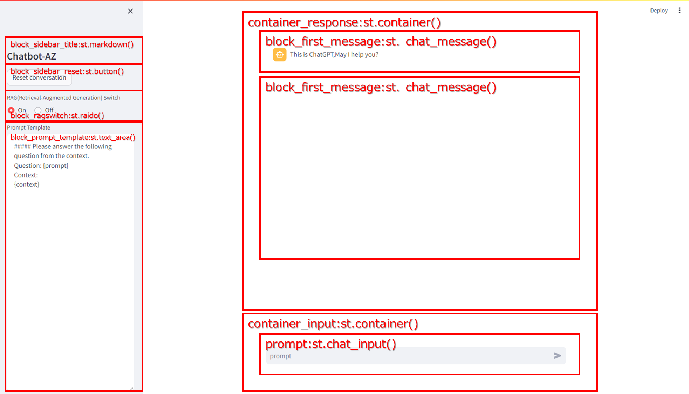

# chatbot-AZ - Simple Chatbot for Azure OpenAI Service with RAG


## Description
This is a sample program for novice programmers to learn how to use the Azure OpenAI Service API
 and RAG(Retrieval-Augmented Generation).
It demonstrates how to interact with the OpenAI Chat Completion API, how to handle 
conversation continuity, and how to process Embedding using RAG(Retrieval-Augmented Generation).

Use Chroma for the vector database, and Chroma measures the distance 
 between vectors using HNSW(Hierarchical Navigable Small World),
 an ANN(Approximate Nearest Neighbor search) algorithm.
For Distance Metrics, we use cosine similarity, a distance calculation algorithm.
In Sentence transformer, use intfloat/multilingual-e5-large, a LLM(Large Language Model), 
 and generate 1024-dimensional vector data with a token length of 512.

## Sample Program List
To implement RAG (Retrieval-Augmented Generation) using the Chroma vector database in chatbot-AZ.py, you need to register the Chroma database and dummy data. Therefore, we have included sample programs for starting the Chroma database, registering, querying, and deleting collections.

| Filename             | Description                                                              |
| -------------------- | ------------------------------------------------------------------------ |
| run_vectordb.bat     | Starts the Chroma vector database in server mode on localhost:8080       |
| info_vectordb.py     | A program that displays information about the vector database version and its collections |
| register_vectordb.py | A program that stores dummy data for RAG (in the EVALRAG collection) in the vector database  |
| query_vectordb.py    | A simple query program for the Chroma vector database                    |
| delete_vectordb.py   | A program that deletes the dummy data for RAG (from the EVALRAG collection) stored in the vector database |
| chatbot-AZ.py        | A sample Chatbot program where RAG can be used with the vector database  |

## Specifications of the Chatbot

- The tokens include the last 5 conversations between the user and the assistant, including the latest one. This ensures continuity of the conversation and makes it appear as if the conversation is ongoing.
- The system prompt is fixed as follows:

```python
**As an experienced engineer, you will step-by-step consider complex technical problems, answer questions and provide advice.**

```

- The token limit size for the prompt is set to 800 tokens in the API instructions. If this limit is exceeded, an error is expected.
- API calls are intended to be asynchronous, with the response messages being streamed in real-time to the response container in Streamlit. However, there is a bug that prevents displaying while communicating asynchronously.

## Installation
The prerequisite packages for chatbot-AZ are listed in requirements.txt after normalization. Please install them with the following pip install command.
**pip install -r requirements.txt**
It is recommended to build a Python virtual environment (python -m venv venv) as your execution environment.
```shell
(venv) D:\Python\chatbot-AZ>pip install -r requirements.txt
Collecting openai==0.27.8 (from -r requirements.txt (line 1))
  Using cached openai-0.27.8-py3-none-any.whl.metadata (13 kB)
Collecting streamlit==1.27.1 (from -r requirements.txt (line 2))
  Using cached streamlit-1.27.1-py2.py3-none-any.whl.metadata (8.0 kB)
Collecting python-dotenv==1.0.0 (from -r requirements.txt (line 3))
  Using cached python_dotenv-1.0.0-py3-none-any.whl (19 kB)
Collecting chromadb==0.4.17 (from -r requirements.txt (line 4))
  Using cached chromadb-0.4.17-py3-none-any.whl.metadata (7.3 kB)
Collecting langchain==0.0.334 (from -r requirements.txt (line 5))
  Using cached langchain-0.0.334-py3-none-any.whl.metadata (16 kB)
Collecting unstructured==0.10.30 (from -r requirements.txt (line 6))

  ...

Installing collected packages: wcwidth, sentencepiece, pytz, pyreadline3, pypika, pure-eval, mpmath, monotonic, flatbuffers, filetype, zipp, wrapt, websockets, websocket-client, watchdog, validators, urllib3, tzdata, typing-extensions, traitlets, tornado, toolz, toml, threadpoolctl, tenacity, tabulate, sympy, soupsieve, sniffio, smmap, six, safetensors, rpds-py, regex, rapidfuzz, PyYAML, python-magic, python-iso639, python-dotenv, pygments, pyasn1, protobuf, prompt-toolkit, pillow, parso, packaging, overrides, opentelemetry-semantic-conventions, oauthlib, numpy, networkx, mypy-extensions, multidict, mdurl, MarkupSafe, lxml, jsonpointer, joblib, importlib-resources, idna, humanfriendly, httptools, h11, grpcio, greenlet, fsspec, frozenlist, filelock, executing, exceptiongroup, emoji, decorator, colorama, charset-normalizer, chardet, certifi, cachetools, blinker, bcrypt, backoff, attrs, async-timeout, annotated-types, yarl, tzlocal, typing-inspect, tqdm, SQLAlchemy, scipy, rsa, requests, referencing, python-dateutil, pydantic-core, pyasn1-modules, pyarrow, pulsar-client, opentelemetry-proto, matplotlib-inline, marshmallow, markdown-it-py, langdetect, jsonpatch, jinja2, jedi, importlib-metadata, googleapis-common-protos, gitdb, deprecated, coloredlogs, click, chroma-hnswlib, beautifulsoup4, asttokens, anyio, aiosignal, watchfiles, uvicorn, typer, torch, starlette, stack-data, scikit-learn, rich, requests-oauthlib, pydeck, pydantic, posthog, pandas, opentelemetry-exporter-otlp-proto-common, opentelemetry-api, onnxruntime, nltk, jsonschema-specifications, huggingface-hub, google-auth, gitpython, dataclasses-json, aiohttp, unstructured, torchvision, tokenizers, opentelemetry-sdk, openai, langsmith, kubernetes, jsonschema, ipython, fastapi, transformers, opentelemetry-exporter-otlp-proto-grpc, langchain, altair, streamlit, sentence-transformers, chromadb
Successfully installed MarkupSafe-2.1.5 PyYAML-6.0.1 SQLAlchemy-2.0.25 aiohttp-3.9.3 aiosignal-1.3.1 altair-5.2.0 annotated-types-0.6.0 anyio-3.7.1 asttokens-2.4.1 async-timeout-4.0.3 attrs-23.2.0 backoff-2.2.1 bcrypt-4.1.2 beautifulsoup4-4.12.3 blinker-1.7.0 cachetools-5.3.2 certifi-2024.2.2 chardet-5.2.0 charset-normalizer-3.3.2 chroma-hnswlib-0.7.3 chromadb-0.4.17 click-8.1.7 colorama-0.4.6 coloredlogs-15.0.1 dataclasses-json-0.6.4 decorator-5.1.1 deprecated-1.2.14 emoji-2.10.1 exceptiongroup-1.2.0 executing-2.0.1 fastapi-0.109.1 filelock-3.13.1 filetype-1.2.0 flatbuffers-23.5.26 frozenlist-1.4.1 fsspec-2023.12.2 gitdb-4.0.11 gitpython-3.1.41 google-auth-2.27.0 googleapis-common-protos-1.62.0 greenlet-3.0.3 grpcio-1.60.1 h11-0.14.0 httptools-0.6.1 huggingface-hub-0.20.3 humanfriendly-10.0 idna-3.6 importlib-metadata-6.11.0 importlib-resources-6.1.1 ipython-8.21.0 jedi-0.19.1 jinja2-3.1.3 joblib-1.3.2 jsonpatch-1.33 jsonpointer-2.4 jsonschema-4.21.1 jsonschema-specifications-2023.12.1 kubernetes-29.0.0 langchain-0.0.334 langdetect-1.0.9 langsmith-0.0.86 lxml-5.1.0 markdown-it-py-3.0.0 marshmallow-3.20.2 matplotlib-inline-0.1.6 mdurl-0.1.2 monotonic-1.6 mpmath-1.3.0 multidict-6.0.5 mypy-extensions-1.0.0 networkx-3.2.1 nltk-3.8.1 numpy-1.26.3 oauthlib-3.2.2 onnxruntime-1.17.0 openai-0.27.8 opentelemetry-api-1.22.0 opentelemetry-exporter-otlp-proto-common-1.22.0 opentelemetry-exporter-otlp-proto-grpc-1.22.0 opentelemetry-proto-1.22.0 opentelemetry-sdk-1.22.0 opentelemetry-semantic-conventions-0.43b0 overrides-7.7.0 packaging-23.2 pandas-2.2.0 parso-0.8.3 pillow-10.2.0 posthog-3.3.4 prompt-toolkit-3.0.43 protobuf-4.25.2 pulsar-client-3.4.0 pure-eval-0.2.2 pyarrow-15.0.0 pyasn1-0.5.1 pyasn1-modules-0.3.0 pydantic-2.6.0 pydantic-core-2.16.1 pydeck-0.8.1b0 pygments-2.17.2 pypika-0.48.9 pyreadline3-3.4.1 python-dateutil-2.8.2 python-dotenv-1.0.0 python-iso639-2024.1.2 python-magic-0.4.27 pytz-2024.1 rapidfuzz-3.6.1 referencing-0.33.0 regex-2023.12.25 requests-2.31.0 requests-oauthlib-1.3.1 rich-13.7.0 rpds-py-0.17.1 rsa-4.9 safetensors-0.4.2 scikit-learn-1.4.0 scipy-1.12.0 sentence-transformers-2.2.2 sentencepiece-0.1.99 six-1.16.0 smmap-5.0.1 sniffio-1.3.0 soupsieve-2.5 stack-data-0.6.3 starlette-0.35.1 streamlit-1.27.1 sympy-1.12 tabulate-0.9.0 tenacity-8.2.3 threadpoolctl-3.2.0 tokenizers-0.15.1 toml-0.10.2 toolz-0.12.1 torch-2.0.0 torchvision-0.15.1 tornado-6.4 tqdm-4.66.1 traitlets-5.14.1 transformers-4.37.2 typer-0.9.0 typing-extensions-4.9.0 typing-inspect-0.9.0 tzdata-2023.4 tzlocal-5.2 unstructured-0.10.30 urllib3-2.2.0 uvicorn-0.27.0.post1 validators-0.22.0 watchdog-3.0.0 watchfiles-0.21.0 wcwidth-0.2.13 websocket-client-1.7.0 websockets-12.0 wrapt-1.16.0 yarl-1.9.4 zipp-3.17.0
```

## How to Execute
In the RAG-compatible chatbot-AZ, you first need to start the Chroma database, store data, and then start chatbot-AZ.py.

**1. Starting the Chroma Vector Database**
Start the Chroma Vector Database with the run_vectordb batch file.
  - Execute **run_vectordb.bat**.
```shell
(venv) D:\Python\chatbot-AZ>run_vectordb.bat
                (((((((((    (((((####
             ((((((((((((((((((((((#########
           ((((((((((((((((((((((((###########
         ((((((((((((((((((((((((((############
        (((((((((((((((((((((((((((#############
        (((((((((((((((((((((((((((#############
         (((((((((((((((((((((((((##############
         ((((((((((((((((((((((((##############
           (((((((((((((((((((((#############
             ((((((((((((((((##############
                (((((((((    #########

Running Chroma

Saving data to: ./chroma_data
Connect to chroma at: http://localhost:8080
Getting started guide: https://docs.trychroma.com/getting-started
```

**2. Registering Dummy Vector Data**
Store the dummy data in the Chroma Vector Database.
  - Execute **python register_vectordb.py**.
```shell
(venv) D:\Python\chatbot-AZ>python register_vectordb.py
```

**3. Staring chatbot-AZ.py with Streamlit**. 
Start chatbot-AZ.py on http://localhost:80 by running the following streamlit command. Launching this will open your browser.
  - Execute **streamlit run chatbot-AZ.py --server.port 80**

```shell
(venv) D:\Python\chatbot-AZ>streamlit run chatbot-AZ.py --server.port 80

  You can now view your Streamlit app in your browser.

  Local URL: http://localhost:80
  Network URL: http://192.168.1.137:80

dotenv_path:Q:\OneDrive\Python\chatbot-AZ\.env
Not Found list_message key in session status
[{'content': 'As an experienced engineer, you play the role of thinking '
             'through complex technical issues step by step, answering '
             'questions, and providing advice.',
  'role': 'system'}]
```
This command is used to execute the `chatbot-AZ.py` script on port 80 using `streamlit`.

## Code explanation
This code is a simple chatbot program for Azure OpenAI Service. Here is an explanation of the different sections of the code:

- Import sections: This section imports the necessary modules and packages for the program, including openai, streamlit, and pprint (for debugging).

- Global definitions: This section defines global variables and constants used in the program, such as the maximum number of messages, the Azure OpenAI API parameters, the deployment ID, and the system prompt.

- Global Variables definitions: This section defines two dictionaries, 'dict_message' and 'dict_response', which are used to store the user input messages and the chatbot responses respectively.

- Specify Azure OpenAI API parameters: This section sets the necessary parameters for the Azure OpenAI API, including the API type, API key, API host, and API version.

- Screen Layout definitions: This section defines the layout of the chatbot interface using streamlit container elements. It includes containers for the response messages and the user input.

- First Message: This section displays the first message from the chatbot in the response container.

- form to container_input definitions: This section creates a form to capture the user's input prompt in the input container.

- Restore list_messages from session state: This section checks if the list_messages variable exists in the session state (which persists across multiple interactions with the chatbot). If it exists, it restores the previous messages. Otherwise, it sets the initial system prompt message and saves it in the session state.

- Event Dispatcher: This section handles the event when the user enters a prompt. It adds the user's prompt to the list of messages, displays all the messages in the response container, sends the messages to the Azure OpenAI Chat Completion API, and receives the completion in chunks. It then appends the chatbot's response to the list of messages, purges old messages if necessary, and saves the updated list of messages in the session state for future interactions.

Note: This code is specifically designed to work with Azure OpenAI Service and Streamlit. It leverages the capabilities of these services to create a simple chatbot interface.



## Requirements
- Azure OpenAI Service:
  - You will need an Azure OpenAI endpoint, API key, and API version for this program to work.
  - A subscription to the pay-as-you-go Azure OpenAI Service is required for key issuance.
- openai package (Ver 0.27.8):
  - This program uses the `openai` package to interact with the OpenAI API.
- Streamlit:
  - The program requires Streamlit version 1.24.0 or higher to use `streamlit_chat`.
- python-dotenv:
  - The program requires python-dotenv version 1.0.0 or higher to use get environment valiables.
- chromadb:
- langchain:
- unstructured:
- torch:
- sentence-transformers:

## Establish OpenAI key on Azure OpenAI Service
Here is the process for issuing an API in Azure OpenAI Service:

1. Log in to the Azure portal.
2. Create a resource group.
3. Create Azure OpenAI Service within the resource group.
4. Deploy LLM in Azure OpenAI Studio.
5. Return to Azure OpenAI Service and retrieve the necessary information
   (Endpoint, API key, API version).

This is the process for issuing an API in Azure OpenAI Service. For detailed instructions, please refer to the official Azure documentation.

## Author
- potofo

## Revision
- 2023/09/30 01-00 potofo: Initial Creation.
- 2023/10/01 01-01 portfo: Fixed incremental response from assistant.
- 2023/10/06 01-02 portfo: Consider parameterizing for Azure App Service and environment variables.
- 2024/02/03 01-02 portfo: Changed OPENAI_API_VERSION to latest.
- 2024/02/03 01-03 portfo: Added chroma vector database.


## Disclaimer
Please be aware that we are not responsible for any problems caused by this program.

## Restrictions
-

## License
- MIT License

## Copyright
- Copyright (c) 2023 potofo. All rights reserved.

## Note
-
